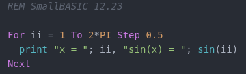

# SmallBASIC syntax coloring for Atom

This Atom package adds syntax coloring and snippets for the SmallBASIC language (https://smallbasic.github.io/)

## Features:
- Syntax coloring
- Code snippets (e.g. For ... Next, If ... Else ... EndIf)

## Installation
### From repository
Copy this folder to the atom package directory (i.e. ~/.atom/packages in Linux) and restart Atom.

### From Atom packages
Search for "lang-smallbasic" and install the package.
