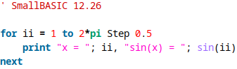

# SmallBASIC syntax coloring for jEdit

- Download the file `smallbasic.xml`
- Start jedit
- Go to `Utilities -> Global Options -> Editing -> Edit Modes`
- In the section `Add Mode` create a new mode:
  - Mode Name: `smallbasic`
  - Select Mode File: select `smallbasic.xml`
  - File Name Glob: `*.bas`
  - First Line Glob: leave empty
- Click button `Add Mode`

Tip: In `Utilities -> Global Options -> Editing -> Edit Modes` you can remove `vbscript` from the section `Selected modes` to make SmallBASIC the standard syntax highlighting for bas files.
