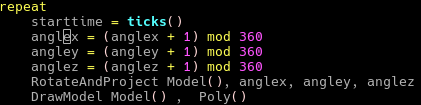

# SmallBASIC syntax coloring for VIM

This vim package adds syntax coloring for the SmallBASIC language (https://smallbasic.github.io/).

## Installation

- Create the folder `~/.vim/syntax`
- Copy the file "smallbasic.vim" into that folder
- Edit or create the file `~/.vim/filetype.vim`
- Add `au BufNewFile,BufRead *.bas set filetype=smallbasic`
